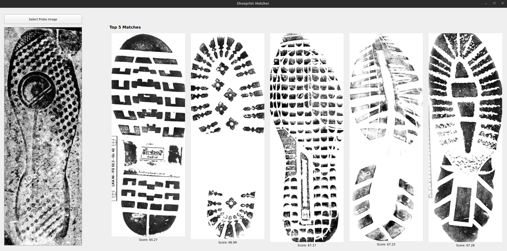

# Installation

## Setup environment
Creating a virtual environment named `.venv_shoeprint`
```TypeScript
python3 -m venv .venv_shoeprint
```

Activate the environement
```TypeScript
source .venv_shoeprint/bin/activate
```

Install other dependencies:
```TypeScript
python3 -m pip install opencv-python-headless
```

## Backend
Install all the package in the virtual environment using the [requirement.txt](./requirements.txt):
```TypeScript
python3 -m pip install -r requirements.txt 

```

## Frontend
Install `PyQt` package:
```TypeScript
pip install PyQt5
```

# Dataset
An open-source database, [CSFID-170](https://fid.dmi.unibas.ch/CSFID.zip), of shoe print is used. This database is a subset of the [FID-300](https://fid.dmi.unibas.ch/) database. 

The dataset is clean and well-suited for the feature extraction and matching. The typcial structure and contents of dataset is stored in the directory [database](./backend/database/).

The detail is as follows: 
```
references/	    - Clean reference impressions; scaled to the mean height of 586 pixels, corresponding to approx. 20 pixel per centimeter
raw/ 	        - Original raw crime scene images by investigation team.
raw_normalized/	- Crime scene impressions are cropped in a way that they are roughly centered in the image frame; scaled to 20 pixel per centimeter.
label_table.csv	- Maps each raw image to its correct reference.
```

# Result
<div style="text-align: center;">
    
</div>
